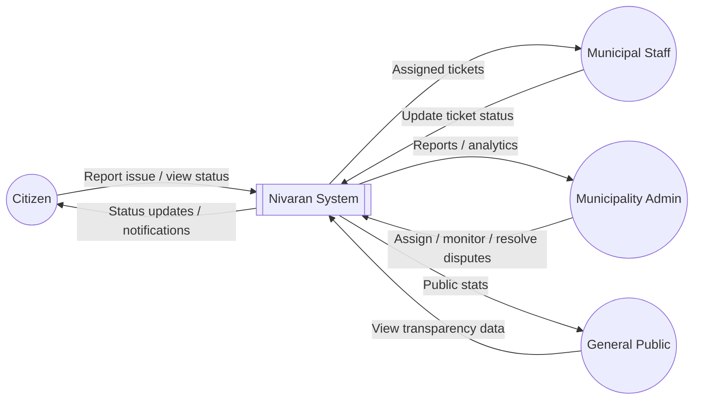
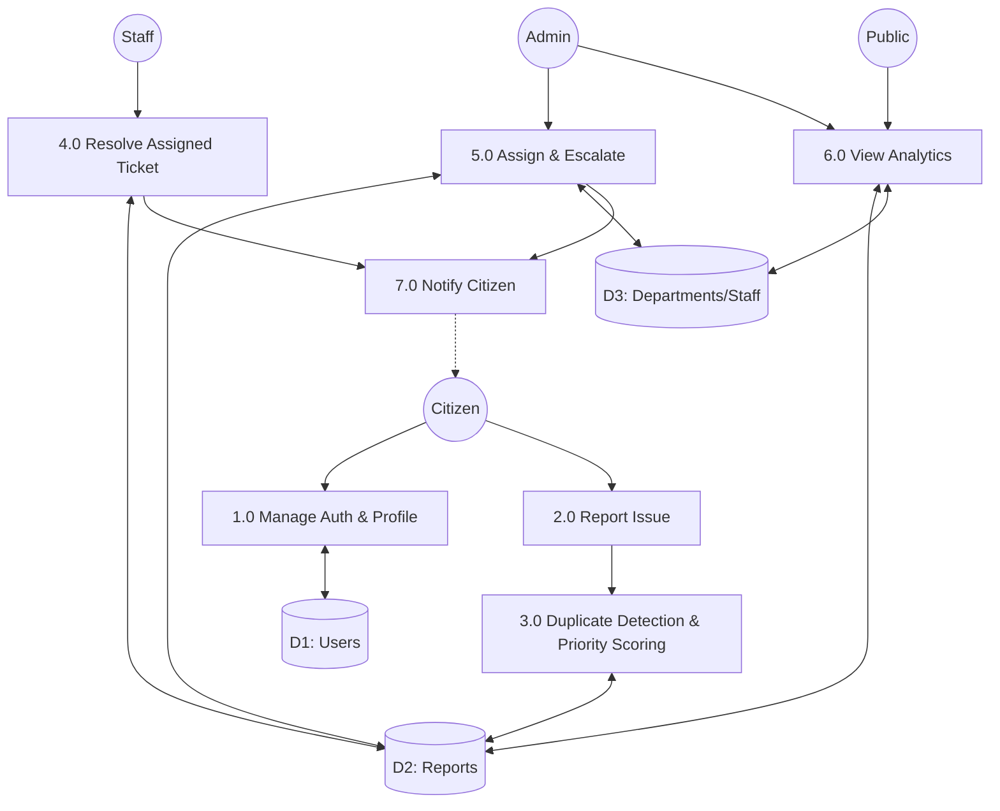

# Nivaran — Crowdsourced Civic Issue Reporting & Resolution Platform

> A MERN stack platform that lets citizens report local civic issues (potholes, garbage, streetlights, water leaks, etc.) with photo + location, automatically detects duplicate reports, prioritizes them intelligently, and gives municipal staff and administrators the tools to track, assign, and resolve them transparently.

**Tagline:** _Report it. Track it. Nivaran — Resolved._

---

## 🎯 Problem Statement

Citizens face broken infrastructure daily — potholes, overflowing garbage, faulty streetlights, water leaks — but reporting is scattered, duplicate complaints flood municipal systems, and there's no transparent tracking of resolution. Nivaran centralizes reporting, eliminates duplicate noise through geolocation-based clustering, prioritizes issues by real urgency signals, and gives full transparency back to citizens and the public.

---

## ✨ Key Features

- 📍 **Geo-tagged issue reporting** with photo upload
- 🔁 **Smart duplicate detection** — merges nearby reports of the same issue instead of creating duplicates (Haversine distance-based)
- ⚖️ **Priority scoring engine** — weighted algorithm ranks issues by urgency (report count, severity, age, upvotes)
- 🎫 **Ticket ID system** — every report gets a trackable ID, just like real 311 systems
- 👥 **Three-role access control** — Citizen, Municipal Staff, and Municipality Admin
- 🗺️ **Live map dashboard** — color-coded by priority
- 🔔 **Real-time status updates** via Socket.io + email fallback
- 📸 **Before/after resolution photos** — visual proof of work
- ⭐ **Citizen satisfaction ratings** feeding into staff/department performance
- ⏱️ **SLA timers & auto-escalation** — unresolved tickets past deadline get flagged and bumped in priority
- 🧑‍🤝‍🧑 **Load-balanced staff assignment** within departments
- 🌐 **Public transparency dashboard** — anyone can view department-wise resolution stats, no login required
- 🕵️ **Anonymous reporting option**v
- 💬 **Comment/update threads** on each report
- 🤖 **AI-assisted auto-categorization** (added as an enhancement layer, with graceful fallback to manual/rule-based categorization)

---

## 👥 Roles

| Role                   | Responsibilities                                                             |
| ---------------------- | ---------------------------------------------------------------------------- |
| **Citizen**            | Report issues, track status, comment, upvote, rate resolutions               |
| **Municipal Staff**    | Handle assigned tickets, update status, upload resolution proof              |
| **Municipality Admin** | Route/assign issues, monitor SLA compliance, manage disputes, view analytics |

---

## 🧠 Core Algorithms

### 1. Duplicate Detection (Haversine Distance)

Detects if a newly reported issue is likely the same as an existing open report within a defined radius (~50m) and the same category, merging reports instead of duplicating them.

### 2. Priority Scoring

```
priorityScore = (reportCount × W1) + (categorySeverityWeight × W2) + (daysOpen × W3) + (upvotes × W4)
```

---

## 🏗️ System Architecture

```mermaid
flowchart TB
    subgraph Client["Client Layer"]
        A1[Citizen Web App]
        A2[Staff Dashboard]
        A3[Admin Dashboard]
        A4[Public Transparency Page]
    end

    subgraph Server["Application Server - Node.js/Express"]
        B1[Auth Service - JWT + OTP]
        B2[Report Service]
        B3[Duplicate Detection Engine]
        B4[Priority Scoring Engine]
        B5[Assignment / SLA Engine]
        B6[Notification Service]
        B7[Analytics Service]
        B8[AI Categorization - enhancement layer]
    end

    subgraph External["External Free Services"]
        C1[(MongoDB Atlas)]
        C2[Cloudinary - Image Storage]
        C3[Nodemailer - Email]
        C4[Leaflet + OpenStreetMap]
        C5[Gemini API - optional]
    end

    A1 --> B1
    A2 --> B1
    A3 --> B1
    A4 --> B7

    B1 --> C1
    B2 --> B3
    B3 --> B4
    B4 --> C1
    B2 --> C2
    B5 --> C1
    B6 --> C3
    B6 -.Socket.io realtime.-> A1
    B6 -.Socket.io realtime.-> A2
    B7 --> C1
    B8 -.optional call.-> C5
    A1 --> C4
    A3 --> C4
```

## 📊 Data Flow Diagrams (DFD)

### DFD Level 0 — Context Diagram

Shows the system as a single process interacting with external entities.



### DFD Level 1 — Major Processes

Breaks the single system process into its core functional processes and data stores.



## 🚀 Getting Started

### Prerequisites

- Node.js (v18+)
- MongoDB Atlas account
- Cloudinary account

### Setup

```bash
# Clone the repo
git clone https://github.com/Ujjwal-0005/nivaran.git
cd nivaran

# Install server dependencies
cd server
npm install

# Install client dependencies
cd ../client
npm install
```

### Environment Variables

Create a `.env` file in `/server`:

```
MONGO_URI=your_mongodb_atlas_uri
JWT_SECRET=your_jwt_secret
CLOUDINARY_CLOUD_NAME=your_cloudinary_name
CLOUDINARY_API_KEY=your_key
CLOUDINARY_API_SECRET=your_secret
EMAIL_USER=your_email
EMAIL_PASS=your_app_password
GEMINI_API_KEY=your_gemini_key   # added in later phase
```

### Run locally

```bash
# Terminal 1 - backend
cd server
npm run dev

# Terminal 2 - frontend
cd client
npm run dev
```

---

## 🗓️ Build Roadmap

- [ ] Auth (register/login/OTP) + 3-role setup
- [ ] Report submission + duplicate detection
- [ ] Citizen dashboard (my reports, comments, ratings)
- [ ] Admin dashboard (map, assignment, SLA/escalation)
- [ ] Staff dashboard (resolve flow, before/after photos)
- [ ] Real-time notifications (Socket.io)
- [ ] Analytics + public transparency dashboard
- [ ] AI auto-categorization (final phase)

---

## 📄 License

This project is developed as an academic capstone project.
