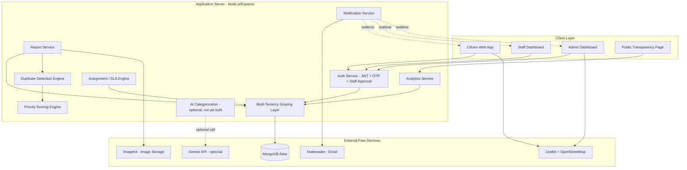
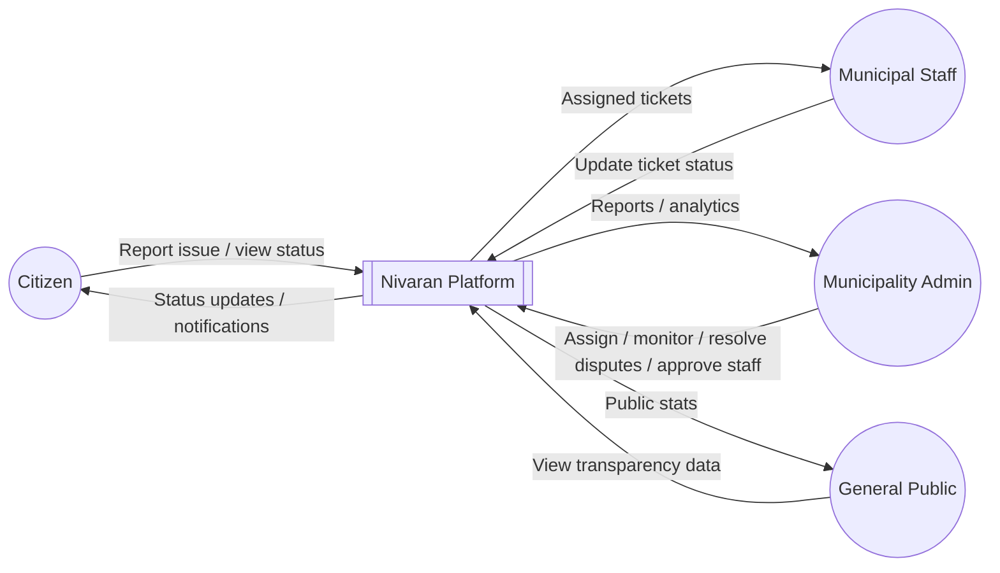
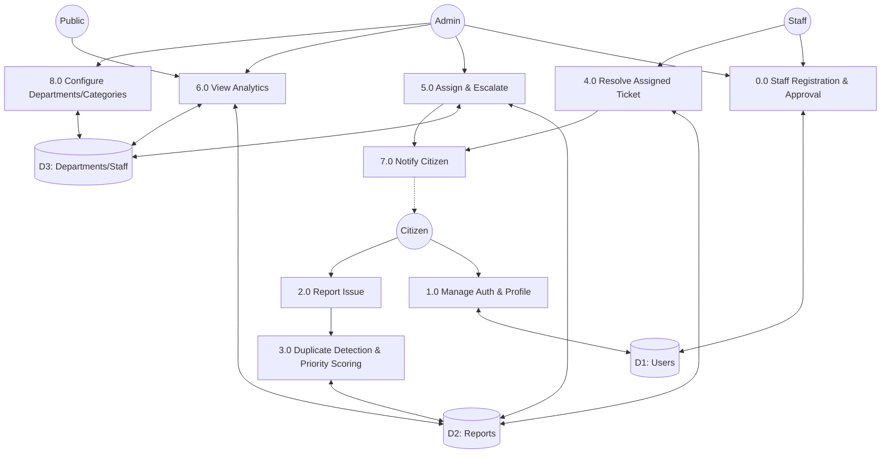
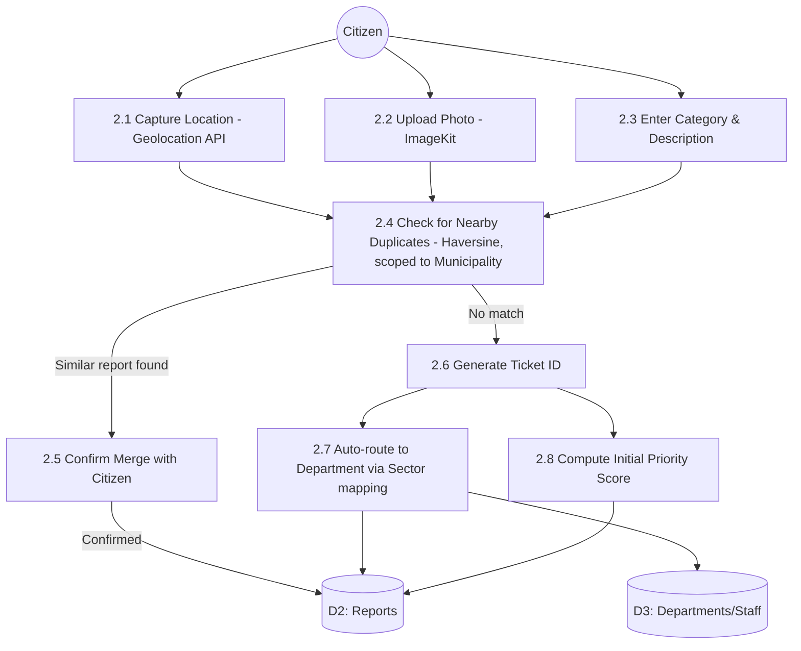

# Nivaran — National Civic Issue Reporting & Resolution Platform

> "निवारण" (Nivaran) means **resolution/remedy** — because every complaint deserves to be resolved, not just recorded.

> A MERN stack, **multi-tenant** platform that lets citizens report local civic issues (potholes, garbage, streetlights, water leaks, etc.) with photo + location, automatically detects duplicate reports, prioritizes them intelligently, and gives municipal staff and administrators the tools to track, assign, and resolve them transparently — architected so any Urban Local Body (ULB) in India can onboard independently, rather than being built for a single city.

**Tagline:** _Report it. Track it. Nivaran — Resolved._

Based on **SIH25031** — _Crowdsourced Civic Issue Reporting and Resolution System_ (Government of Jharkhand, Clean & Green Technology theme), since generalized beyond a single-municipality scope. Modeled on real-world deployed systems like **SeeClickFix**, **FixMyStreet**, and India's own **CPGRAMS** (Centralized Public Grievance Redress and Monitoring System).

---

## 🎯 Problem Statement

Citizens face broken infrastructure daily — potholes, overflowing garbage, faulty streetlights, water leaks — but reporting is scattered, duplicate complaints flood municipal systems, and there's no transparent tracking of resolution. This problem isn't specific to one city — every Urban Local Body in India faces it independently, with no shared platform. Nivaran centralizes reporting per municipality, eliminates duplicate noise through geolocation-based clustering, prioritizes issues by real urgency signals, and gives full transparency back to citizens and the public — while being architected so any municipality can onboard onto the same platform without being hardcoded to one.

---

## 🏛️ Administrative Model

Nivaran's data model follows India's real municipal governance structure, from the **74th Constitutional Amendment**:

```
State
 └── Urban Local Body (Municipal Corporation / Municipal Council / Nagar Panchayat)
       └── Ward
             └── Citizens, Departments, Staff, Reports (all scoped here)
```

Each Urban Local Body (referred to as a **Municipality** in the platform) operates as an independent tenant — its own citizens, staff, departments, and reports are isolated from every other municipality on the platform, while all municipalities share the same core application and national issue taxonomy.

### National taxonomy vs. local implementation

A key design decision: the same civic function (e.g., water supply) is handled by a **different real agency in every city** — BWSSB in Bengaluru, Delhi Jal Board in Delhi, BMC's Water Dept in Mumbai. Hardcoding department names nationally would be inaccurate. So the model separates two layers:

- **Sector** — a small, fixed, _national_ taxonomy (~9 sectors: Water Supply, Electricity, Roads & Transport, Solid Waste Management, Sewerage & Drainage, Parks & Environment, Traffic & Enforcement, Public Health & Sanitation, Animal Husbandry) — never changes city to city
- **Department** — the real local implementing agency (e.g., "BWSSB", "Delhi Jal Board"), created and managed **by that municipality's own admin**, mapped to one Sector, tagged with an `agencyType` (`municipal_corp` vs. `parastatal_board`, since agencies like BWSSB/BESCOM are separate state boards, not part of the municipal corporation itself)
- **Category** (Pothole, Streetlight, etc.) stays fixed and national for consistent cross-municipality analytics, mapped to a Sector — individual municipalities can enable/disable categories and override severity weight / SLA hours to fit their local context, but can't fragment the taxonomy itself

This mirrors the "standardize the service, localize the provider" pattern used by real platforms like India's Sakala and CPGRAMS systems.

---

## 👥 Roles & Hierarchy

```
Platform (Super Admin — bootstraps new municipalities onto the platform; manual/one-time for this project's scale)
 └── Municipality Admin — approves staff, configures departments/categories for their own municipality
       └── Municipal Staff — self-registers, requires admin approval before portal access
 └── Citizen — self-registers freely, no approval needed
```

| Role                   | Responsibilities                                                                                                                                                            |
| ---------------------- | --------------------------------------------------------------------------------------------------------------------------------------------------------------------------- |
| **Citizen**            | Report issues, track status, comment, upvote, rate resolutions, dispute unsatisfactory resolutions                                                                          |
| **Municipal Staff**    | Self-registers (pending admin approval), handles assigned tickets, updates status, uploads mandatory before/after resolution proof                                          |
| **Municipality Admin** | Approves/rejects staff applications, configures local departments and category settings, assigns/routes issues, monitors SLA compliance, resolves disputes, views analytics |

Staff self-registration requires admin approval before portal access — this mirrors real organizational onboarding and prevents anyone from falsely claiming to be a municipal employee and gaining access to ticket assignment/resolution tools.

---

## ✨ Key Features

- 📍 **Geo-tagged issue reporting** with photo upload, GPS-based municipality auto-suggestion at registration
- 🔁 **Smart duplicate detection** — merges nearby reports of the same issue instead of creating duplicates (Haversine distance-based), scoped within a single municipality
- ⚖️ **Priority scoring engine** — weighted algorithm ranks issues by urgency (report count, severity, age, upvotes)
- 🎫 **Ticket ID system** — every report gets a trackable ID, just like real 311 systems
- 🏙️ **Multi-tenant architecture** — any Urban Local Body can onboard independently, with fully isolated data
- 👥 **Role-based access control** — Citizen, Municipal Staff (approval-gated), Municipality Admin
- 🗺️ **Live map dashboard** (Leaflet + OpenStreetMap) — color-coded by priority
- 🔔 **Real-time status updates** via Socket.io + email fallback
- 📸 **Before/after resolution photos** — mandatory visual proof of work
- ⭐ **Citizen satisfaction ratings** feeding into staff/department performance
- ⏱️ **SLA timers & auto-escalation** — unresolved tickets past deadline get flagged and bumped in priority
- 🧑‍🤝‍🧑 **Load-balanced staff assignment** within departments (Future Scope)
- 🌐 **Public transparency dashboard** — anyone can view department-wise resolution stats, no login required
- 🕵️ **Anonymous reporting option**
- 💬 **Comment/update threads** on each report
- ⚖️ **Admin-mediated dispute resolution** — disputed resolutions route to Admin, not back to the original field staff
- 🤖 **AI-assisted auto-categorization** _(optional enhancement layer/ Future Scope — planned, not yet built)_

---

## 🛠️ Tech Stack

| Layer                                         | Technology                                                 |
| --------------------------------------------- | ---------------------------------------------------------- |
| Frontend                                      | React (Vite), Tailwind CSS                                 |
| Backend                                       | Node.js + Express                                          |
| Database                                      | MongoDB (Atlas)                                            |
| Auth                                          | JWT + OTP verification                                     |
| Maps                                          | Leaflet.js + OpenStreetMap, Nominatim (reverse geocoding)  |
| Image Storage                                 | ImageKit                                                    |
| Real-time                                     | Socket.io                                                  |
| Email                                         | Nodemailer                                                 |
| Scheduled Jobs(Future Scope)                  | node-cron (SLA escalation)                                 |
| Charts                                        | Recharts                                                   |
| AI (optional enhancement layer/ Future Scope) | Gemini API — auto-categorization, with rule-based fallback |
| Deployment                                    | Vercel (frontend) · Render (backend) · MongoDB Atlas (DB)  |

---

## 🧠 Core Algorithms

### 1. Duplicate Detection (Haversine Distance)

Detects if a newly reported issue is likely the same as an existing open report within a defined radius (~50m), the same category, and a recent time window — scoped to comparisons **within a single municipality only**. Citizens are shown the possible match and asked to confirm ("is this the same issue?") rather than being silently auto-merged, mirroring how real systems like FixMyStreet handle this.

### 2. Priority Scoring

```
priorityScore = (reportCount × W1) + (categorySeverityWeight × W2) + (daysOpen × W3) + (upvotes × W4)
```

A fully explainable, self-designed weighted formula — no black-box AI involved in core prioritization logic. Escalated tickets (past SLA deadline) receive an additional priority boost.

---

## 🏗️ System Architecture


```mermaid
flowchart TB
    subgraph Client["Client Layer"]
        A1[Citizen Web App]
        A2[Staff Dashboard]
        A3[Admin Dashboard]
        A4[Public Transparency Page]
    end

    subgraph Server["Application Server - Node.js/Express"]
        B0[Multi-Tenancy Scoping Layer]
        B1[Auth Service - JWT + OTP + Staff Approval]
        B2[Report Service]
        B3[Duplicate Detection Engine]
        B4[Priority Scoring Engine]
        B5[Assignment / SLA Engine]
        B6[Notification Service]
        B7[Analytics Service]
        B8[AI Categorization - optional, not yet built]
    end

    subgraph External["External Free Services"]
        C1[(MongoDB Atlas)]
        C2[ImageKit - Image Storage]
        C3[Nodemailer - Email]
        C4[Leaflet + OpenStreetMap]
        C5[Gemini API - optional]
    end

    A1 --> B1
    A2 --> B1
    A3 --> B1
    A4 --> B7

    B1 --> B0
    B2 --> B0
    B5 --> B0
    B7 --> B0
    B0 --> C1

    B2 --> B3
    B3 --> B4
    B2 --> C2
    B6 --> C3
    B6 -.->|realtime| A1
    B6 -.->|realtime| A2
    B6 -.->|realtime| A3
    B8 -.->|optional call| C5
    A1 --> C4
    A3 --> C4
```

Every request that touches Reports, Staff, or Departments passes through the **Multi-Tenancy Scoping Layer**, which filters by the requesting user's `municipality` — enforced server-side, not just hidden in the UI, so one municipality can never see or act on another's data even via direct API calls.

---

## 📊 Data Flow Diagrams (DFD)

### DFD Level 0 — Context Diagram


```mermaid
flowchart LR
    Citizen((Citizen)) -- Report issue / view status --> SYS[["Nivaran Platform"]]
    Staff((Municipal Staff)) -- Update ticket status --> SYS
    Admin((Municipality Admin)) -- Assign / monitor / resolve disputes / approve staff --> SYS
    Public((General Public)) -- View transparency data --> SYS
    SYS -- Status updates / notifications --> Citizen
    SYS -- Assigned tickets --> Staff
    SYS -- Reports / analytics --> Admin
    SYS -- Public stats --> Public
```

### DFD Level 1 — Major Processes


```mermaid
flowchart TB
    Citizen((Citizen)) --> P1[1.0 Manage Auth & Profile]
    Citizen --> P2[2.0 Report Issue]
    Staff((Staff)) --> P0[0.0 Staff Registration & Approval]
    Staff --> P4[4.0 Resolve Assigned Ticket]
    Admin((Admin)) --> P0
    Admin --> P5[5.0 Assign & Escalate]
    Admin --> P6[6.0 View Analytics]
    Admin --> P8[8.0 Configure Departments/Categories]
    Public((Public)) --> P6

    P0 <--> D1[(D1: Users)]
    P1 <--> D1
    P2 --> P3[3.0 Duplicate Detection & Priority Scoring]
    P3 <--> D2[(D2: Reports)]
    P5 <--> D2
    P5 <--> D3[(D3: Departments/Staff)]
    P8 <--> D3
    P4 <--> D2
    P4 --> P7[7.0 Notify Citizen]
    P5 --> P7
    P7 -.-> Citizen
    P6 <--> D2
    P6 <--> D3
```

### DFD Level 2 — Expansion of "2.0 Report Issue"


```mermaid
flowchart TB
    Citizen((Citizen)) --> S1[2.1 Capture Location - Geolocation API]
    Citizen --> S2[2.2 Upload Photo - ImageKit]
    Citizen --> S3[2.3 Enter Category & Description]
    S1 --> S4[2.4 Check for Nearby Duplicates - Haversine, scoped to Municipality]
    S2 --> S4
    S3 --> S4
    S4 -- Similar report found --> S5[2.5 Confirm Merge with Citizen]
    S4 -- No match --> S6[2.6 Generate Ticket ID]
    S5 -- Confirmed --> D2[(D2: Reports)]
    S6 --> S7[2.7 Auto-route to Department via Sector mapping]
    S7 --> D2
    S7 --> D3[(D3: Departments/Staff)]
    S6 --> S8[2.8 Compute Initial Priority Score]
    S8 --> D2
```

---

## 🚀 Getting Started

### Prerequisites

- Node.js (v18+)
- MongoDB Atlas account
- ImageKit account
- Docker Desktop _(optional — for one-command local dev setup)_

### Setup

```bash
# Clone the repo
git clone https://github.com/<your-org>/nivaran.git
cd nivaran

# Install server dependencies
cd server
npm install

# Install client dependencies
cd ../client
npm install
```

### Environment Variables

Create a `.env` file in `/server`:

```
MONGO_URI=your_mongodb_atlas_uri
JWT_SECRET=your_jwt_secret
IMAGEKIT_PUBLIC_KEY=your_imagekit_public_key
IMAGEKIT_PRIVATE_KEY=your_imagekit_private_key
IMAGEKIT_URL_ENDPOINT=your_imagekit_url_endpoint
EMAIL_USER=your_email
EMAIL_PASS=your_app_password
GEMINI_API_KEY=your_gemini_key   # only needed if the optional AI phase is built
```

### Run locally

```bash
# Terminal 1 - backend
cd server
npm run dev

# Terminal 2 - frontend
cd client
npm run dev
```

Or, with Docker Desktop installed, run the whole stack (backend, frontend, local Mongo) with a single command via `docker compose up` — see `docker-compose.yml`. This is for local development convenience only; production deployment still uses Vercel + Render + MongoDB Atlas directly.

---

## 🌍 Real-World Design References

- **SeeClickFix, FixMyStreet, 311 systems** — general civic-issue-reporting UX and workflow patterns
- **CPGRAMS** (India's Centralized Public Grievance Redress and Monitoring System) — the routing/multi-jurisdiction model Nivaran's multi-tenancy architecture mirrors
- **74th Constitutional Amendment** — the State → Urban Local Body → Ward administrative hierarchy this data model follows
- Real Indian municipal agency structures (e.g., BWSSB, BESCOM, Delhi Jal Board) — informing the Sector/Department separation, since the same civic function is handled by differently-named agencies across cities

---

## 📄 License

This project is developed as an academic capstone project.
